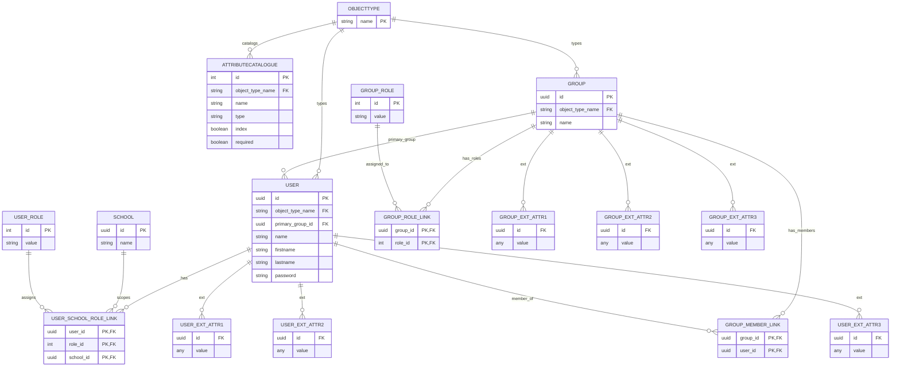

# Models

## 6NF (simplified)

```mermaid
erDiagram
    OBJECTTYPE {
      string name PK
    }

    ATTRIBUTECATALOGUE {
      int id PK
      string object_type_name FK
      string name
      string type
      boolean index
      boolean required
    }

    SCHOOL {
      uuid id PK
      string name
    }

    "USER" {
      uuid id PK
      string object_type_name FK
      uuid primary_group_id FK
      string name
      string firstname
      string lastname
      string password
    }

    "GROUP" {
      uuid id PK
      string object_type_name FK
      string name
    }

    USER_ROLE {
      int id PK
      string value
    }

    USER_SCHOOL_ROLE_LINK {
      uuid user_id PK, FK
      int role_id PK, FK
      uuid school_id PK, FK
    }

    GROUP_MEMBER_LINK {
      uuid group_id PK, FK
      uuid user_id PK, FK
    }

    GROUP_ROLE {
      int id PK
      string value
    }

    GROUP_ROLE_LINK {
      uuid group_id PK, FK
      int role_id PK, FK
    }

    %% Dynamic attribute tables (assumed 3 each)
    USER_EXT_ATTR1 {
      uuid id FK
      any value
    }
    USER_EXT_ATTR2 {
      uuid id FK
      any value
    }
    USER_EXT_ATTR3 {
      uuid id FK
      any value
    }

    GROUP_EXT_ATTR1 {
      uuid id FK
      any value
    }
    GROUP_EXT_ATTR2 {
      uuid id FK
      any value
    }
    GROUP_EXT_ATTR3 {
      uuid id FK
      any value
    }

    %% Relationships
    OBJECTTYPE ||--o{ ATTRIBUTECATALOGUE : catalogs
    OBJECTTYPE ||--o{ "USER" : types
    OBJECTTYPE ||--o{ "GROUP" : types

    "GROUP" ||--o{ "USER" : primary_group
    "USER"  ||--o{ USER_SCHOOL_ROLE_LINK : has
    SCHOOL  ||--o{ USER_SCHOOL_ROLE_LINK : scopes
    USER_ROLE ||--o{ USER_SCHOOL_ROLE_LINK : assigns

    "GROUP" ||--o{ GROUP_MEMBER_LINK : has_members
    "USER"  ||--o{ GROUP_MEMBER_LINK : member_of

    "GROUP" ||--o{ GROUP_ROLE_LINK : has_roles
    GROUP_ROLE ||--o{ GROUP_ROLE_LINK : assigned_to

    %% Dynamic attributes: base object -> extension rows
    "USER"  ||--o{ USER_EXT_ATTR1 : ext
    "USER"  ||--o{ USER_EXT_ATTR2 : ext
    "USER"  ||--o{ USER_EXT_ATTR3 : ext

    "GROUP" ||--o{ GROUP_EXT_ATTR1 : ext
    "GROUP" ||--o{ GROUP_EXT_ATTR2 : ext
    "GROUP" ||--o{ GROUP_EXT_ATTR3 : ext
```
