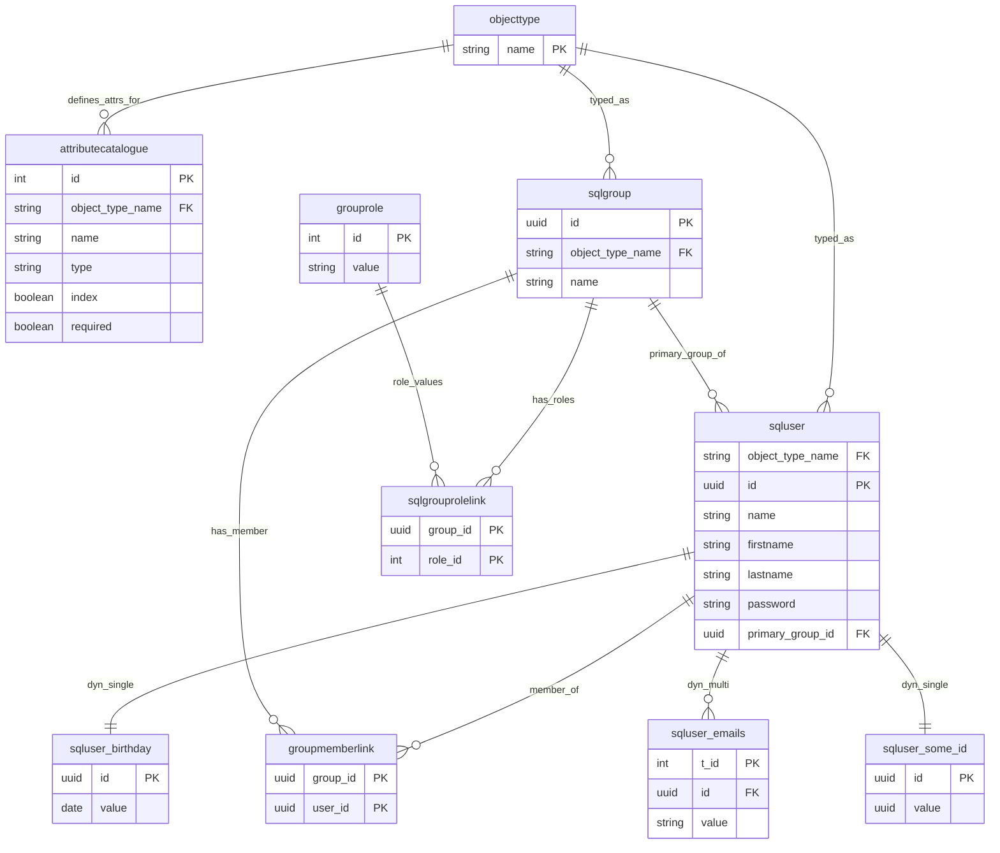

# Models

## 6NF (simplified)

```mermaid
erDiagram
  %% Goal: keep core identity + membership + roles in 3NF,
  %% but model *dynamic* attributes in 6NF (one table per attribute).

  %% --- Dynamic attribute catalogue (3NF) ---
  %% This describes which dynamic-attribute tables exist per object type.
  objecttype {
    string name PK
  }
  attributecatalogue {
    int     id                  PK
    string  object_type_name    FK
    string  name
    string  type
    boolean index
    boolean required
  }
  objecttype ||--o{ attributecatalogue : defines_attrs_for

  %% --- Core (3NF) ---
  sqluser {
    string object_type_name     FK
    uuid   id                   PK
    string name
    string firstname
    string lastname
    string password
    uuid   primary_group_id     FK
  }

  sqlgroup {
    uuid   id                   PK
    string object_type_name     FK
    string name
  }

  groupmemberlink {
    uuid group_id   PK
    uuid user_id    PK
  }

  %% Group roles (deduplicated many-to-many, 3NF)
  grouprole {
    int    id       PK
    string value
  }
  sqlgrouprolelink {
    uuid group_id   PK
    int  role_id    PK
  }

  %% Relationships
  objecttype ||--o{ sqluser : typed_as
  objecttype ||--o{ sqlgroup : typed_as
  sqlgroup ||--o{ sqluser : primary_group_of
  sqluser  ||--o{ groupmemberlink : member_of
  sqlgroup ||--o{ groupmemberlink : has_member

  sqlgroup  ||--o{ sqlgrouprolelink : has_roles
  grouprole ||--o{ sqlgrouprolelink : role_values

  %% --- Dynamic attributes (6NF) ---
  %% Each dynamic attribute lives in its own table:
  %% - single-value: (id PK/FK -> sqluser.id)
  %% - multi-value:  (t_id PK) + (id FK -> sqluser.id)

  sqluser ||--|| sqluser_birthday : dyn_single
  sqluser_birthday {
    uuid id         PK
    date value
  }

  sqluser ||--o{ sqluser_emails : dyn_multi
  sqluser_emails {
    int  t_id       PK
    uuid id         FK
    string value
  }

  sqluser ||--|| sqluser_some_id : dyn_single
  sqluser_some_id {
    uuid id         PK
    uuid value
  }
```
